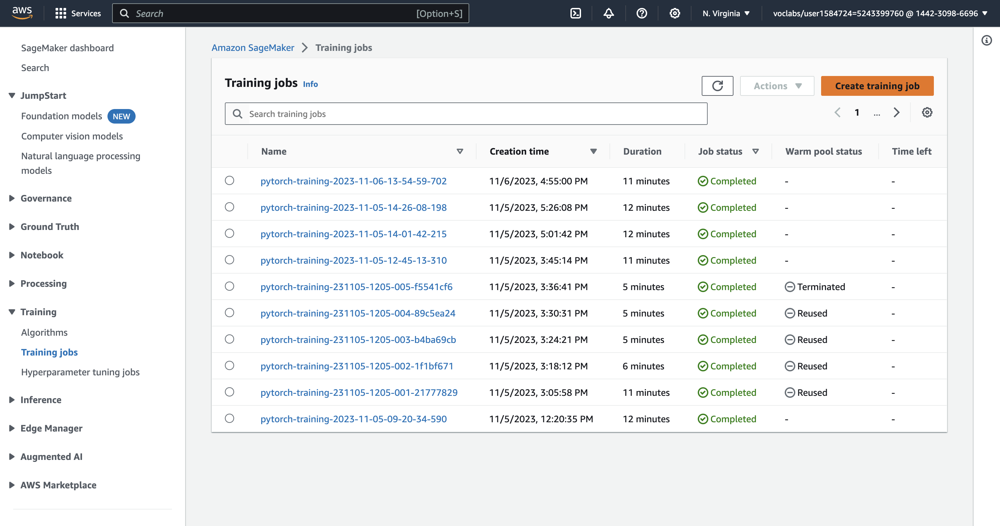
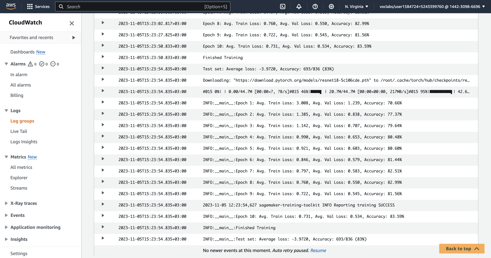
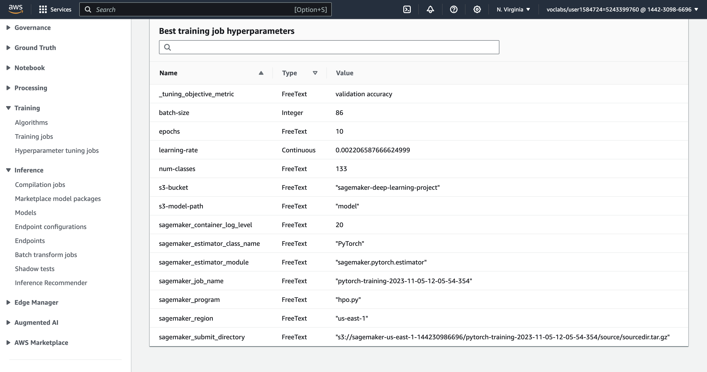
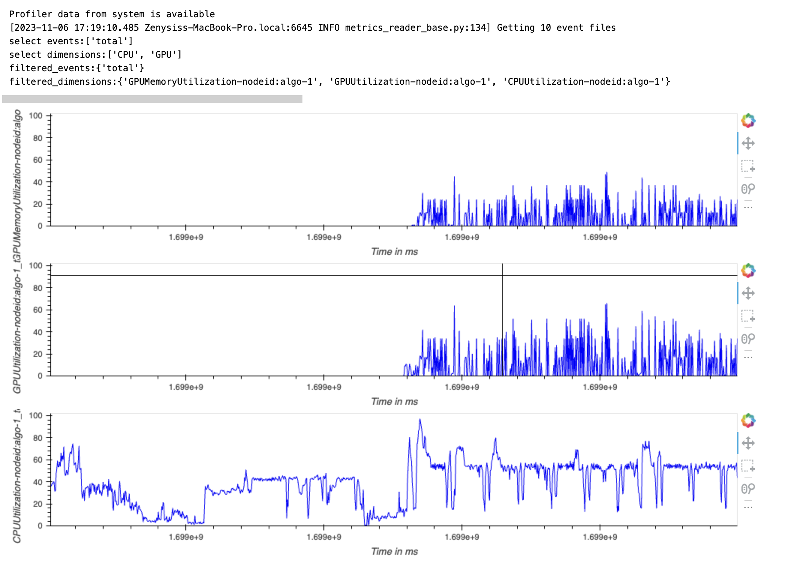
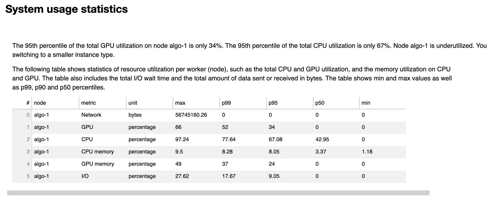
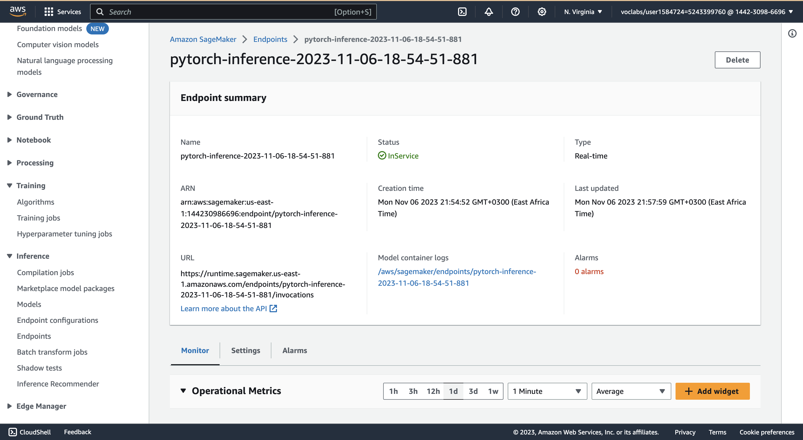

# Image Classification using AWS SageMaker

Use AWS Sagemaker to train a pretrained model that can perform image classification by using the Sagemaker profiling, debugger, hyperparameter tuning and other good ML engineering practices. This can be done on either the provided dog breed classication data set or one of your choice.

## Project Set Up and Installation
Enter AWS through the gateway in the course and open SageMaker Studio. 
Download the starter files.
Download/Make the dataset available. 

## Dataset
The provided dataset is the dogbreed classification dataset which can be found in the classroom.
The project is designed to be dataset independent so if there is a dataset that is more interesting or relevant to your work, you are welcome to use it to complete the project.

### Access
Upload the data to an S3 bucket through the AWS Gateway so that SageMaker has access to the data. 

## Hyperparameter Tuning
I opted for the ResNet18 architecture due to its efficiency and speed during both training and inference stages, attributed to its compact structure and fewer parameters, especially when contrasted with larger models such as ResNet50 or ResNet152. For the hyperparameter optimization, I employed a continuous learning rate ranging from 0.001 to 0.1, along with a variable batch size set as an integer parameter that spans from 16 to 128.

Remember that your README should:
- Completed training jobs

- Logs metrics during the training process

- Best best hyperparameters from all the training jobs

- Hyperparameters training job

## Debugging and Profiling
In my SageMaker project, I conducted model debugging by incorporating SageMaker Debugger with specific rules to automatically monitor the training process for potential issues. The rules I set up included checks for non-decreasing loss, vanishing gradients, overfitting, overtraining, and poor weight initialization. These rules, facilitated by `smdebug`, allowed for an automated and systematic approach to detecting and diagnosing training inefficiencies and errors. By using predefined rule configurations such as loss_not_decreasing() and vanishing_gradient(), the debugger provided alerts whenever these common issues arose, enabling timely intervention.

To complement the debugging process, I configured the SageMaker Profiler to closely observe the model's resource utilization. The ProfilerConfig set a system monitoring interval of 500 milliseconds and a detailed framework profile for every ten steps of model training. With the use of ProfilerRule.sagemaker(), I ensured that I was notified of low GPU utilization and could access comprehensive profiling reports. The DebuggerHookConfig also allowed me to specify the frequency of saved data during training and evaluation, further enhancing my visibility into the model's performance. This combined debugging and profiling strategy allowed for a streamlined optimization process, helping to ensure efficient training and effective resource use.

### Results

This image shows three separate line graphs that are monitoring the performance metrics of a computer system, likely while running a machine learning or other computationally intensive task.

- GPU Memory Utilization: The top graph shows the GPU memory usage over time. A fully utilized GPU memory would show as a more constant line at a high percentage, while this graph shows spikes and drops, indicating variable usage of the GPU memory.

- GPU Utilization: The middle graph shows how much of the GPU's computational power is being used. Like the memory usage, we see spikes and drops, suggesting that the GPU's processing power is not being used consistently.

- CPU Utilization: The bottom graph shows the CPU usage over time. Unlike the GPU graphs, this line is smoother, which could mean that the CPU is being used more steadily but not necessarily at full capacity.

The graphs suggest that the workload for this system is somewhat sporadic, with variable use of GPU memory and computational power, and a steadier but not fully maximized CPU usage. This might indicate that the task is not fully optimized to use the GPU resources continuously, which could be due to reasons like data not being fed to the GPU quickly enough or inefficient parallelization of the task.

Here's a simple breakdown of the key points:

- **Network**: The maximum amount of data sent or received is 56,745,160.26 bytes (or approximately 54 MB), but the percentiles suggest that typically there is no network activity (possibly indicating batch processing or local processing that doesn't require constant network use).

- **GPU**: The maximum GPU usage is 66%, but typically (at the 95th percentile) it's only 34%. This suggests that the GPU is not being fully utilized most of the time.

- **CPU**: The CPU usage is quite high with a maximum of 97.24%. The 95th percentile is 67.08%, which indicates a relatively high usage, but also suggests there is some room for more load.

- **CPU Memory**: The CPU memory usage is quite low with a maximum of 9.5%. Even at the 99th percentile, it only reaches 8.28%, indicating that there is a lot of unused CPU memory capacity.

- **GPU Memory**: The maximum GPU memory usage is 49% with the 99th percentile at 37%, indicating that almost half of the GPU memory capacity is not used.

- **I/O**: The I/O percentage is relatively low with a maximum of 27.62%. At the 95th percentile, the I/O is 9.05%, indicating that the disk or network I/O isn't a major bottleneck.

More insights into the debugging can be found in the profiler report.

## Model Deployment
Our model is a PyTorch-based deep learning model that has been trained to perform image classification tasks. It's been packaged into a SageMaker PyTorchModel object, which allows it to be easily deployed to an AWS SageMaker endpoint. This endpoint provides a REST API that can be used to run predictions against the model with new data, in real time.

Here's a step-by-step guide to query the endpoint with a sample image:

- **Deploy the Model**: You've already deployed the model to an endpoint using the provided code snippet. This will return a predictor object that references the endpoint.

- **Obtain Image Data**: Use the requests library to fetch an image from a provided URL. The image data needs to be in a binary format, which is what the requests.get call will return.

- **List Endpoints**: Use the sagemaker Boto3 client to list all the deployed endpoints and select the most recently created one. This is the endpoint that will be used for the prediction.

- **Invoke the Endpoint**: Send the image data to the endpoint using the invoke_endpoint method from the sagemaker-runtime Boto3 client. You need to specify the EndpointName, the ContentType (in this case, 'application/x-image'), and the image data as the Body.

- **Process the Response**: The endpoint will return a response with the prediction. Read the response, decode it from a byte string to a JSON string, and then parse it into a Python object (likely a list or a dictionary).

- **Interpret the Prediction**: Convert the prediction into a numpy array and use np.argmax to find the index of the highest confidence score. This index represents the predicted class.

